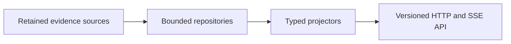

# Observatory v3 backend

This directory owns the new Observatory backend.

## Boundary

- B1 introduces the first production implementation.
- New code is designed from the accepted contracts and performance gates.
- Old Observatory source is not copied, imported, or executed here.
- Reference behavior is reconciled through fixtures and external comparison.
- No placeholder runtime is present before its owning step is accepted.
