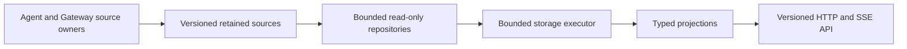
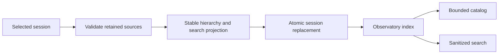
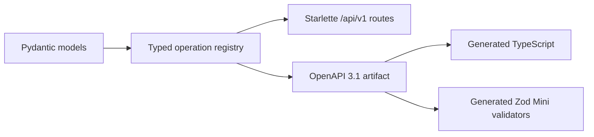

# Observatory v3 backend

This package owns the standalone Observatory backend.



## Source boundary

- The launcher owns registry schema version 1 and its migration from version 0.
- Gateway journals own schema version 1.
- The Observatory validates source schemas without mutating them.
- Unknown schemas fail without changing source bytes.
- Selected-session lookup uses the indexed registry identity.
- Evidence reads never widen to unrelated sessions.

## Repository responsibilities

| Module | Responsibility |
|---|---|
| `registry.py` | bounded catalog and direct session lookup |
| `events.py` | bounded gateway event pages |
| `agent.py` | byte-cursor agent JSONL pages |
| `operator.py` | retained Goal and Nudge messages |
| `lifecycle.py` | launcher lifecycle history |
| `control.py` | effective control state without credential reads |
| `storage_executor.py` | bounded cancellation-aware off-loop execution |

The compatibility projections and routes preserve the accepted Observatory
behavior while `/api/v1` exposes the canonical public contract.

## Disposable index



- `.boukensha/observatory/index-v1.sqlite3` is derived and disposable.
- Startup creates an empty schema and never scans retained sessions.
- An explicit rebuild reads one selected session before opening its transaction.
- UUIDv5 identities use retained source anchors, not display counters.
- Catalog reads use keyset pagination and never compute a total count.
- Full-text search indexes an explicit sanitized allowlist.
- The launcher registry and gateway journals remain query-only.
- Unknown or corrupt index schemas require explicit recreation.

## Public contract



- `/api/v1/openapi.json` publishes the local canonical schema.
- `/api/v1/health` and `/api/v1/capabilities` are the first callable resources.
- Future bounded resource and notification shapes are components, not false
  placeholder routes.
- Future optimistic command and durable receipt shapes follow the same rule.
- `openapi/observatory-v1.json` is the deterministic generation input.
- `openapi/operations.json` is the stable operation manifest.
- Unknown prior and future API versions return typed JSON errors.
- Compatibility routes remain unchanged until their replacement gate.

## Development

Use the pinned Python and locked dependencies.

```bash
uv sync
uv run ruff format --check src tests
uv run ruff check src tests
uv run mypy
uv run pytest
uv run observatory-v3-openapi
```

## Dependencies

| Dependency | Role |
|---|---|
| Python `ThreadPoolExecutor` | owned fixed-capacity storage workers |
| AnyIO 4.14.2 | concurrency and cancellation tests |
| Pydantic 2.13.4 | typed runtime contracts |
| Starlette 1.3.1 | current stable local ASGI surface |
| Uvicorn 0.52.1 | local ASGI server |
| HTTPX 0.28.1 | ASGI and upstream contract tests |
| PyYAML 6.0.3 | shared settings parsing |
| openapi-spec-validator 0.9.0 | independent OpenAPI 3.1 contract gate |

The complete backend architecture and performance budgets are in
[the backend architecture plan](../../../docs/plans/week2_observ/observatory/backend_architecture.md).
