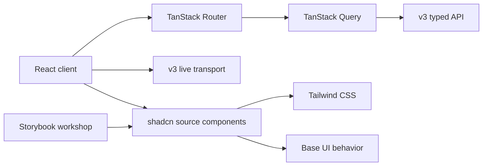

# Observatory v3 web

This package is the Observatory v3 React application. It consumes only the
typed API and live transport owned by the sibling v3 backend.

## Foundation

- Node `24.18.0` and npm `11.16.0` are fixed by `.nvmrc` and package engines.
- Dependencies are exact and reproducible through `package-lock.json`.
- TypeScript is strict across application, configuration, and test sources.
- Oxlint checks React, imports, Vitest, and JSX accessibility.
- Vitest and Testing Library cover component behavior.
- Playwright and axe cover browser behavior and accessibility.
- Architecture checks block old Observatory imports and bypasses.
- Orval generates TypeScript and status-specific Zod Mini validators.
- Network values enter application code as `unknown` and validate in `src/data`.
- Production builds exclude the development review module.
- Tailwind consumes semantic Observatory tokens instead of a literal palette.
- Dark and light values retain frozen source and computed-style evidence.
- Canonical primitives own every Base UI behavior import.
- Storybook isolates every primitive and its supported interaction states.

The development server exposes the cumulative foundation review and the
deterministic backend B0 measurements. The production build exposes only the
production application boundary.

## Semantic visual foundation

The token layer retains accepted Observatory values behind shared names.

- Foundation tokens cover canvas, surfaces, content, lines, and overlays.
- Intent tokens cover accent, success, warning, danger, belief, and cost.
- Lifecycle tokens distinguish idle, checking, running, success, stopped, and
  failed states.
- Map tokens cover navigation, room, terrain, and landmark states.
- Typography separates interface text from timestamp, cost, and trace data.
- Geometry covers spacing, radii, controls, density, focus, motion, elevation,
  and layers.
- The development gallery renders every category in dark and light themes.
- Playwright compares representative computed values with the frozen app on
  port `8787`.
- Playwright screenshots and axe guard the cumulative review gallery.

## Backend B0 evidence

- A generated development artifact records the measured current API path.
- The fixture contains 66 sessions and a stopped session with 2,233 gateway
  events and 1,040 agent records.
- Unrelated sessions retain 21,766 gateway events and 8,640 agent records.
- Measurements report p50 and nearest-rank p95 latency.
- Failure cards show unrelated-session hydration, full-history folding,
  unbounded detail payloads, and partial-line rejection.
- The measured artifact and review components are excluded from production.

## Canonical UI primitives

The component layer is the only feature-facing presentation boundary.

- Controls include Button, IconButton, Input, and SearchInput.
- Status includes Badge and lifecycle-aware StatusBadge.
- Surfaces include Card and ScrollArea.
- Navigation includes Tabs and Select.
- Disclosure includes Dialog, Popover, DropdownMenu, Tooltip, and Collapsible.
- CVA owns visual variants where a component supports multiple appearances.
- Base UI owns keyboard, focus, selection, dismissal, and restoration behavior.
- The development review shows the cumulative component layer with FT1 tokens.
- Storybook 10.5.5 provides directly selectable dark, light, normal, and dense
  workshop states.
- The Storybook build runs axe against every selectable story.

## Commands

| Command                      | Purpose                                             |
| ---------------------------- | --------------------------------------------------- |
| `npm run dev`                | Start Vite with Fast Refresh                        |
| `npm run format:check`       | Check repository formatting                         |
| `npm run typecheck`          | Check TypeScript without emitting files             |
| `npm run lint`               | Run Oxlint across the package                       |
| `npm run architecture:check` | Enforce runtime ownership boundaries                |
| `npm run contracts:generate` | Generate types and runtime validators               |
| `npm run contracts:check`    | Check deterministic output and operation coverage   |
| `npm test`                   | Run component tests                                 |
| `npm run test:e2e`           | Run Chromium and axe browser gates                  |
| `npm run storybook`          | Start the isolated primitive workshop               |
| `npm run storybook:build`    | Build the pinned development-only workshop          |
| `npm run storybook:test`     | Run axe across every selectable built story         |
| `npm run build`              | Typecheck, build, and inspect the production bundle |
| `npm run check`              | Run every landing gate                              |

## Dependency roles

| Dependency                   | Reason                                                           |
| ---------------------------- | ---------------------------------------------------------------- |
| React and React DOM          | Typed component runtime and browser rendering                    |
| Vite and React plugin        | Development server, Fast Refresh, and production build           |
| Tailwind CSS and Vite plugin | Zero-runtime utility styling                                     |
| shadcn and Base UI           | Repository-owned components over accessible behavior             |
| TanStack Router              | Typed URL and navigation state for the shell landing             |
| TanStack Query               | Request lifecycle and server-state ownership                     |
| Lucide React                 | Tree-shakeable interface icons                                   |
| Oxlint                       | Full-source TypeScript, React, import, and accessibility linting |
| Prettier                     | Deterministic source and Tailwind class ordering                 |
| Vitest and Testing Library   | Component behavior verification                                  |
| Playwright and axe           | Browser and accessibility verification                           |
| Storybook 10.5.5             | Isolated primitive states and cumulative component workshop      |
| Orval 8.23.0                 | OpenAPI TypeScript and Zod generation                            |
| Zod 4.4.3 Mini               | Tree-shakeable runtime contract validation                       |

Router and server-state packages are installed but remain inactive until their
own accepted landings.

## Boundaries

- No runtime import may leave this package.
- No code or stylesheet from `observatory/` or `observatory_v2/` may become a
  dependency.
- Presentation components do not call `fetch` or create polling loops.
- Feature components do not author transport request or response types.
- API route literals and network transports remain inside `src/data`.
- Internal navigation does not use raw document or history APIs.
- Product routes and semantic visual tokens arrive only in their owning
  landings.
